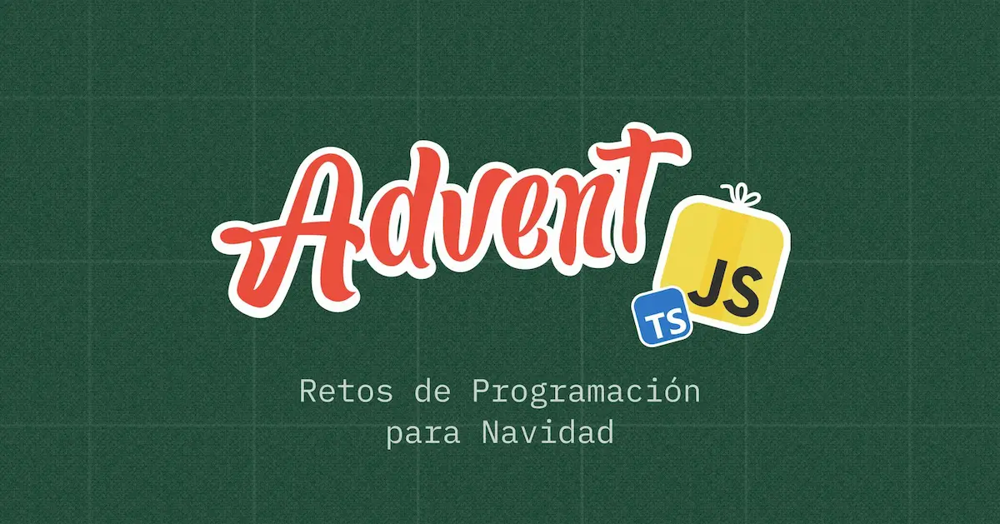

# AdventJS 2024

Mis soluciones a los retos del [AdventJS](https://adventjs.dev/es) de [midudev](https://github.com/midudev) :)


## Ejecutar solución

```bash
# ejecutar con `npx tsx <dia>`. ejemplo:
npx tsx 1
```
